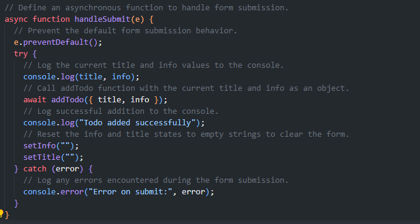
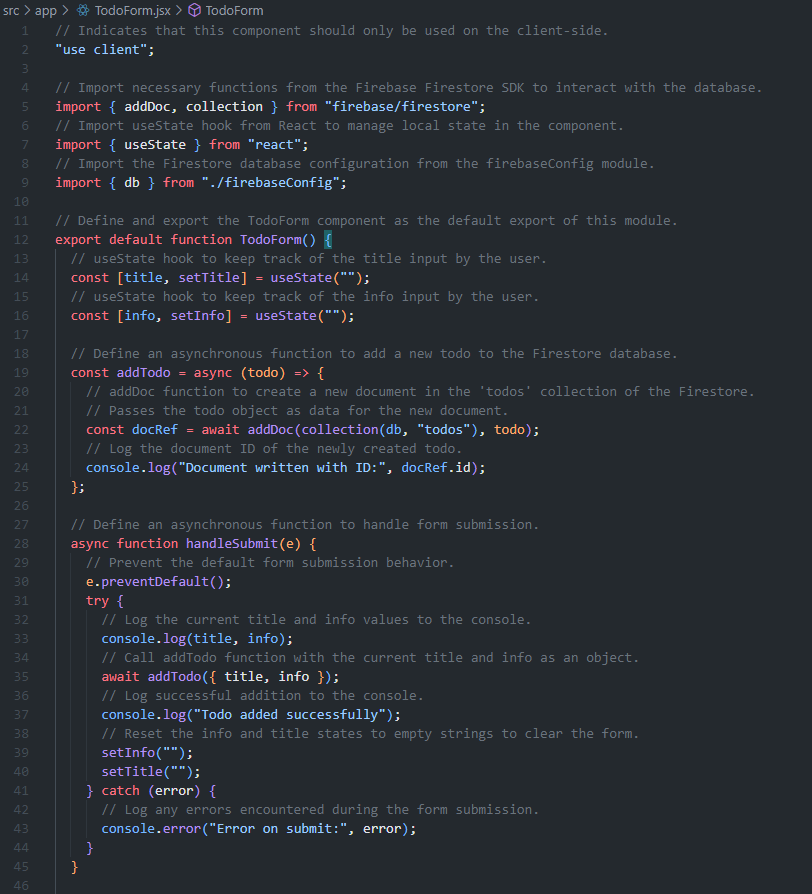

# Objective
Enhance your Firebase and Next.js integration skills by recreating a project similar to Firebase Assignment 3, this time incorporating real-time data listening with Firestore. This assignment focuses on understanding and implementing live data synchronization within a Next.js application.

# Instructions
## Part 1: Initialize a New Next.js Project with Firestore
### Create a New Next.js Project: 
Use create-next-app to initiate a new project setup.

### Setup Firebase and Firestore: 
Install Firebase, set up a new Firebase project in the Firebase Console, and initialize Firebase in your Next.js project as shown in previous assignments.

## Part 2: Implement Real-Time Data Addition and Display
### Develop a RealTimeForm Component:
This component should include input fields relevant to your chosen data model (e.g., a user's name and message).
Implement functionality to add new documents to a Firestore collection upon form submission. This collection can be named according to your data model, such as realTimeMessages.

### Create a RealTimeDisplay Component:
This component is responsible for displaying documents from your Firestore collection.
Use Firestore's onSnapshot to subscribe to real-time updates from your collection, ensuring that any additions, updates, or deletions are instantly reflected in your application's UI.

## Part 3: Documentation and Submission
### Provide Detailed Code Comments: 
Explain your code, especially the parts implementing real-time updates with Firestore's onSnapshot.
Credit to ChatGPT for code comments.

### Update README.md:
Describe the process of setting up Firestore for real-time updates in your new Next.js project.
1. In the terminal, run 'npx create-next-app@latest' and follow the steps given to set up the file structure.
2. Run the command 'npm i firebase'.
3. Navigate into your project's src/app directory in VS Code.
4. Create a file called 'firebaseConfig.js'.
5. Add the following code: 

6. Create a file called 'TodoForm.jsx' and add the following code:

7. Create a file called 'TodoList.jsx' and add the following code:

8. Create a file called 'UpdateTodoForm.jsx' and add the following code:

9. Add the following code to 'page.js':

Credits: Credit to ChatGPT for detailed explanations of firebase, assistance with code implementation, and code comments.